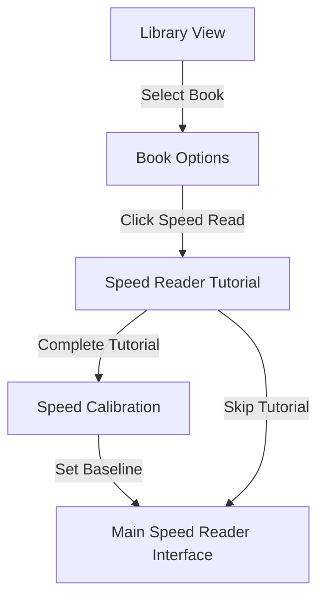
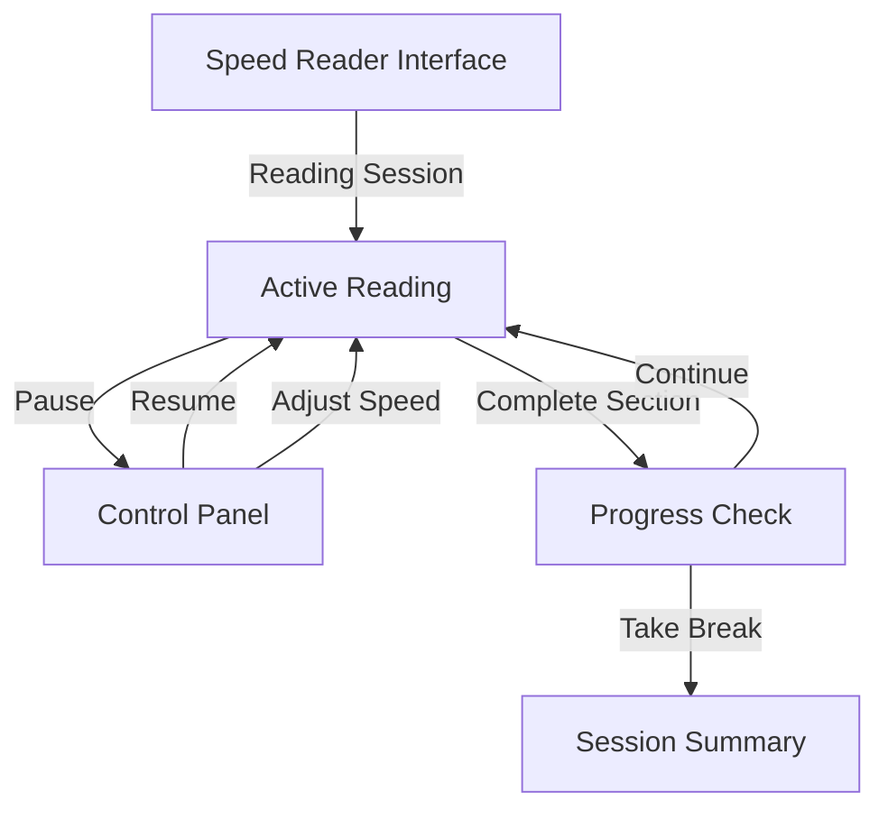
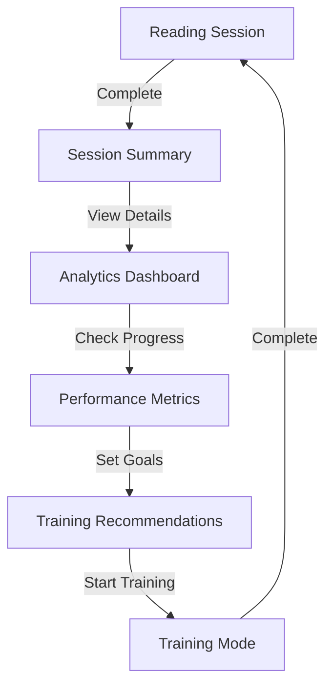
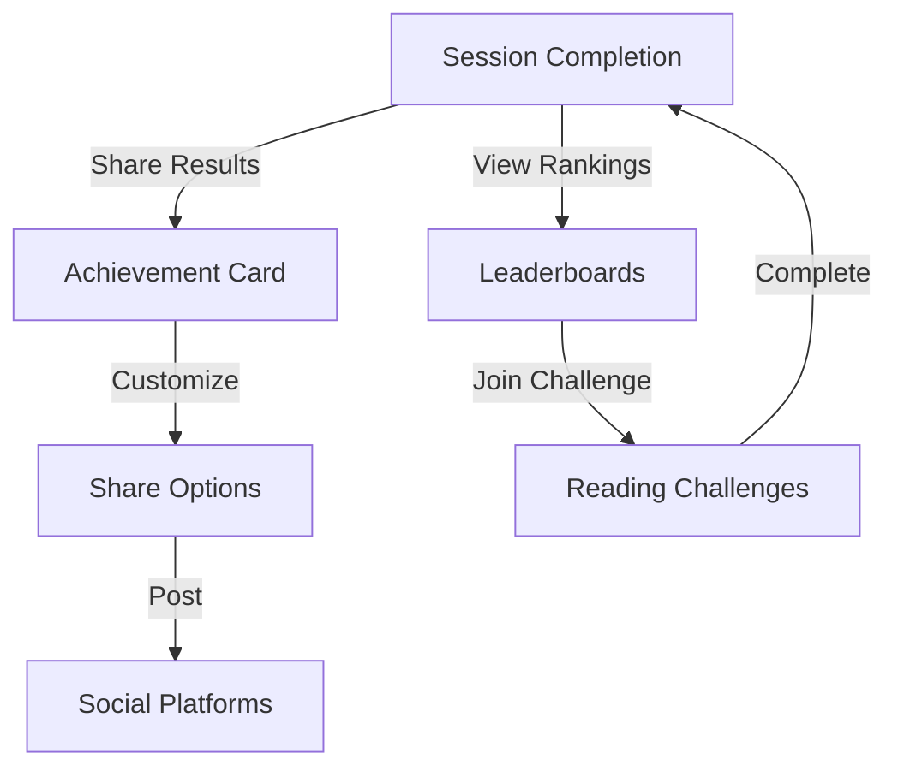
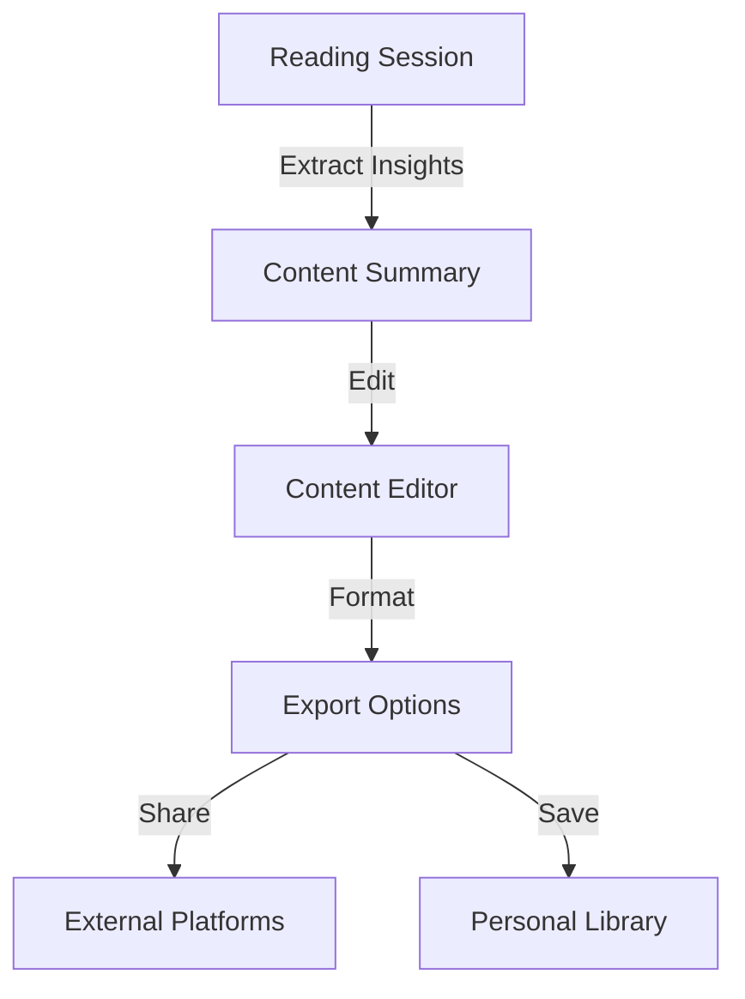
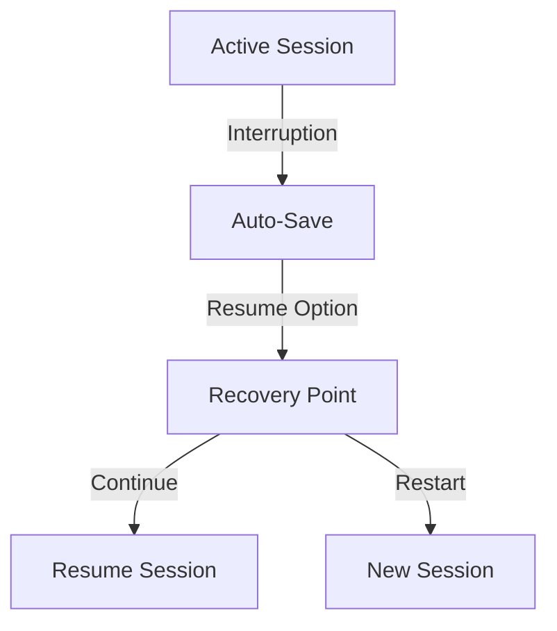
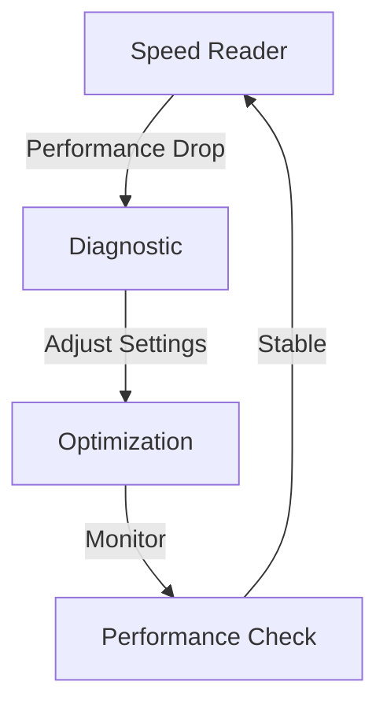

 # Speed Reader User Flow

## Overview
This document outlines the user journey through the Speed Reader feature in Koodo Reader, mapping key touchpoints, interactions, and transitions between different features.

## Core User Journeys

### 1. Initial Entry & Onboarding

#### Flow Details
1. **Library Entry**
   - User accesses their library
   - Selects a book for speed reading
   - Option to start speed reading appears alongside normal reading mode

2. **First-Time Experience**
   - Tutorial introduction to the matrix-themed interface
   - Explanation of ORP (Optimal Recognition Point)
   - Basic controls walkthrough
   - Option to skip tutorial for experienced users

3. **Speed Calibration**
   - Baseline reading speed measurement
   - Initial comprehension test
   - Personalized speed recommendation
   - Setting preferences for matrix animation intensity

### 2. Main Reading Experience

#### Flow Details
1. **Reading Interface**
   - Matrix-themed RSVP display
   - Word-by-word presentation
   - Real-time speed control
   - Progress indicator
   - Contextual imagery transitions

2. **Control Options**
   - WPM adjustment slider
   - Pause/Resume
   - Section navigation
   - Theme customization
   - Background animation intensity

3. **Progress Tracking**
   - Words per minute display
   - Session duration
   - Progress percentage
   - Comprehension checkpoints

### 3. Comprehension & Analytics

#### Flow Details
1. **Session Completion**
   - Summary of reading metrics
   - Option for comprehension test
   - Performance feedback
   - Recommendations for next session

2. **Analytics Review**
   - Speed vs. comprehension graphs
   - Progress over time
   - Content type performance
   - Achievement tracking

3. **Training Integration**
   - Suggested exercises
   - Speed progression path
   - Technique refinement
   - Customized practice sessions

### 4. Social & Sharing Features

#### Flow Details
1. **Achievement Sharing**
   - Customizable achievement cards
   - Performance metrics display
   - Social media integration
   - Community engagement

2. **Community Features**
   - Global leaderboards
   - Reading challenges
   - Friend competitions
   - Progress sharing

### 5. Content Creation & Export

#### Flow Details
1. **Content Processing**
   - Key point extraction
   - Summary generation
   - Quote collection
   - Note organization

2. **Export Options**
   - Social media formats
   - Blog post templates
   - Newsletter adaptation
   - Knowledge base integration

## Feature Interconnections

### 1. Library Integration
- Seamless transition between normal and speed reading modes
- Shared progress tracking
- Unified content management
- Cross-mode bookmarking

### 2. Settings Synchronization
- Reading preferences
- Visual theme settings
- Performance configurations
- Device synchronization

### 3. Data Management
- Progress tracking
- Performance history
- Content annotations
- Export formats

## User Customization Points

### 1. Interface Preferences
- Matrix animation intensity
- Color schemes
- Font settings
- Animation speed

### 2. Reading Parameters
- Default WPM
- Comprehension test frequency
- Progress indicators
- Break intervals

### 3. Social Settings
- Privacy preferences
- Sharing defaults
- Challenge participation
- Community visibility

## Error Handling & Recovery

### 1. Session Interruption

### 2. Performance Issues

## Success Metrics Tracking

### 1. User Progress
- Reading speed improvement
- Comprehension maintenance
- Session completion rates
- Feature utilization

### 2. System Performance
- Load times
- Animation smoothness
- Resource usage
- Error rates

### 3. Engagement Metrics
- Session frequency
- Duration trends
- Social sharing
- Community participation

## Integration Points

### 1. External Services
- Cloud synchronization
- Social media platforms
- Content creation tools
- Analytics services

### 2. Internal Systems
- Library management
- User preferences
- Progress tracking
- Content processing

## Accessibility Considerations

### 1. Interface Adaptation
- Screen reader compatibility
- Keyboard navigation
- Color contrast options
- Font scaling

### 2. Cognitive Support
- Pace adjustment
- Break reminders
- Progress indicators
- Clear instructions

## Mobile Considerations

### 1. Touch Interface
- Gesture controls
- Screen optimization
- Portrait/landscape adaptation
- Battery efficiency

### 2. Offline Support
- Local storage
- Progress syncing
- Content caching
- Performance optimization 